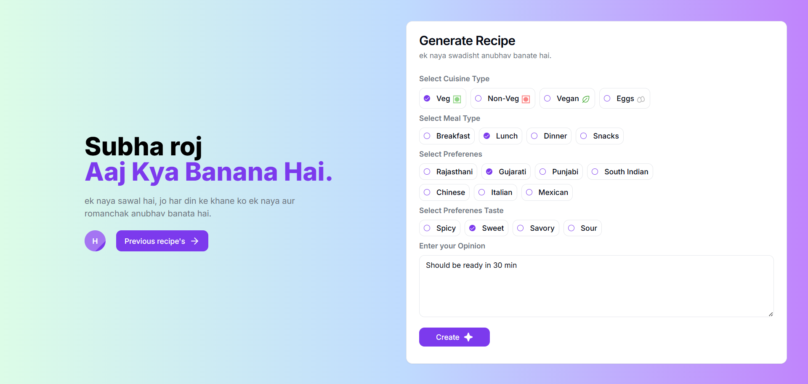
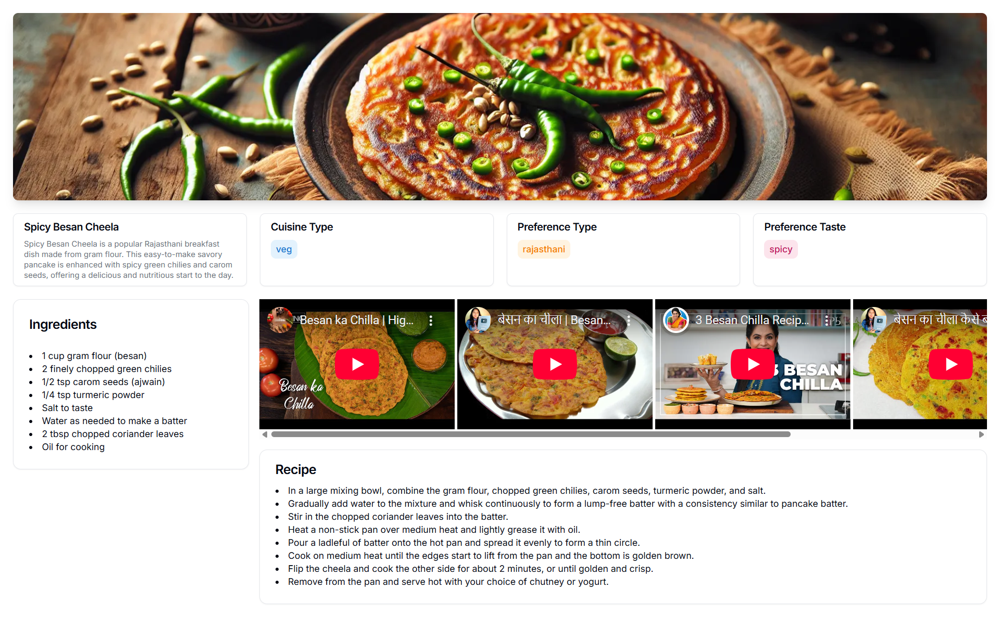
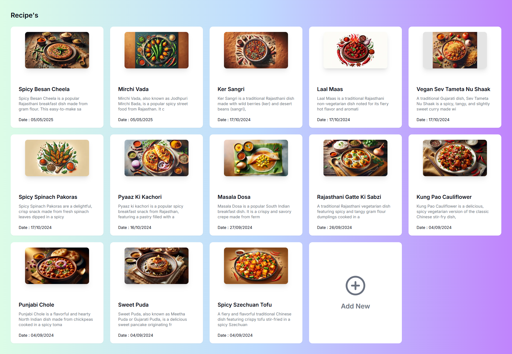

# 🍽️ Kya Banana Hai – AI-Powered Kitchen Assistant

[KyaBananaHai.com](https://kyabananahai.com) is a smart kitchen assistant that helps you decide **what food to cook** based on ingredients, time, mood, or dietary needs — using the power of AI.

🎥 **Live Demo:** [https://kyabananahai.com](https://kyabananahai.com)
📦 **Frontend Repo:** [kyabananahai-app-fe](https://github.com/Hitesh-s0lanki/kyabananahai-app-fe)

---

## 👨‍🍳 What is “Kya Banana Hai”?

> “Kya Banana Hai” (Hindi for “What should I cook?”) is your AI-driven helper that solves the daily struggle of deciding what to prepare for meals.

Just enter what you have, how much time you can spare, or your mood—and it gives back relevant, creative food suggestions with simple instructions.

---

## 🍲 Features

- 🧠 **AI Recipe Suggestions** – Get food ideas based on your query like “I have rice and tomatoes” or “I want something quick and spicy”.
- ⏱ **Time-based Filtering** – Ask for “breakfast in 10 minutes” or “dinner under 30 minutes”.
- 🍴 **Ingredient-Based Search** – Finds recipes based on what you have at home.
- 🥗 **Healthy/Easy/Comfort Options** – Suggests meals based on dietary or mood preferences.
- 💬 **Simple Chat UI** – One input box, endless possibilities.

---

## 🛠 Tech Stack

**Frontend:**

- Next.js
- TypeScript
- Tailwind CSS
- ShadCN UI components

**AI & Backend:**

- OpenAI API (GPT-4 for smart suggestions)

**Hosting:**

- Vercel (CI/CD + Hosting)

---

## 📸 Preview

> Add screenshots like:

```



```

---

## 🚀 Getting Started

### 1. Clone the Repository

```bash
git clone https://github.com/Hitesh-s0lanki/kyabananahai-app-fe.git
cd kyabananahai-app-fe
```

### 2. Install Dependencies

```bash
npm install
```

### 3. Configure Environment Variables

Create a `.env.local` file:

```env
NEXT_PUBLIC_OPENAI_API_KEY=your-openai-api-key
```

### 4. Start Development Server

```bash
npm run dev
```

Visit `http://localhost:3000`

---

## ☁️ Deployment

This app is hosted live on [Vercel](https://vercel.com) with GitHub integration. Every commit to `main` auto-deploys.

---

## 🔮 Future Enhancements

- 📷 Upload fridge image → detect ingredients using vision AI
- 📝 Save favorite recipes
- 🛒 Auto-generate grocery list
- 📆 Weekly meal planner

---

## 🤝 Contributing

Have ideas to make food decisions smarter? PRs are welcome!

---
